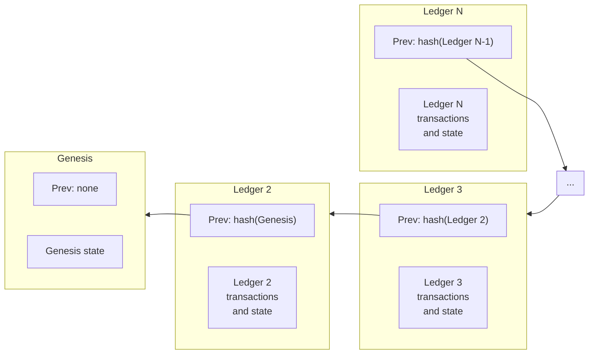

Every ledger has a header that references the data in that ledger and the previous ledger. These references are cryptographic hashes of the content which behave like pointers in typical data structures but with added security guarantees. Think of a historical ledger chain as a linked list of ledger headers. Time flows forward from left to right, hashes point backwards in time, from right to left. Each hash in the chain links a ledger to its previous ledger, which authenticates the entire history of ledgers in its past:



The genesis ledger has a sequence number of 1. The ledger directly following a ledger with sequence number `N` has a sequence number of `N + 1`. Ledger `N + 1` contains a hash of ledger `N` in its previous ledger field.

## Consensus Fields

### Version

The protocol version of this ledger.

### Previous Ledger Hash

Hash of the previous ledger.

### SCP Value

During consensus, all the validating nodes in the network run SCP and agree on a particular value, which is a transaction set they will apply to a ledger. This value is stored here and in the following three fields (transaction set hash, close time, and upgrades).

### Transaction Set Hash

Hash of the transaction set applied to the previous ledger.

### Transaction Set Result Hash

Hash of the results of applying the transaction set. This data is not necessary for validating the results of the transactions. However, it makes it easier for entities to validate the result of a given transaction without having to apply the transaction set to the previous ledger.

### Close Time

The close time is a UNIX timestamp indicating when the ledger closes. Its accuracy depends on the system clock of the validator proposing the block. Consequently, SCP may confirm a close time that lags a few seconds behind or up to 60 seconds ahead. It is strictly monotonic - guaranteed to be greater than the close time of an earlier ledger.

### Upgrades

The `upgrades` array in the SCP value contains the network changes agreed to during consensus. It is usually empty. Each [`LedgerUpgrade`](https://github.com/stellar/stellar-xdr/blob/v27.0/Stellar-ledger.x#L149-L169) identifies the type of change and carries the proposed new value. Once accepted, Stellar Core applies that value to the corresponding ledger-header field or configuration entry:

| Upgrade type | Payload | Destination or effect |
| --- | --- | --- |
| `LEDGER_UPGRADE_VERSION` | `newLedgerVersion` | `LedgerHeader.ledgerVersion` |
| `LEDGER_UPGRADE_BASE_FEE` | `newBaseFee` | `LedgerHeader.baseFee` |
| `LEDGER_UPGRADE_MAX_TX_SET_SIZE` | `newMaxTxSetSize` | `LedgerHeader.maxTxSetSize`, the native transaction-set limit |
| `LEDGER_UPGRADE_BASE_RESERVE` | `newBaseReserve` | `LedgerHeader.baseReserve` |
| `LEDGER_UPGRADE_FLAGS` | `newFlags` | `LedgerHeader.ext.v1.flags` |
| `LEDGER_UPGRADE_CONFIG` | `newConfig` | The [`ConfigSettingEntry`](./entries.mdx#config-setting) records identified by a `ConfigUpgradeSetKey` |
| `LEDGER_UPGRADE_MAX_SOROBAN_TX_SET_SIZE` | `newMaxSorobanTxSetSize` | `ConfigSettingContractExecutionLanesV0.ledgerMaxTxCount`, the Soroban transaction-set limit |

The upgrade type and destination are distinct. `LEDGER_UPGRADE_FLAGS` has the discriminant value `5`, which tells Stellar Core to interpret the payload as a flags mask; `5` is not itself a flag value. If validators accept an upgrade whose `newFlags` value is `3`, Core stores `3` in `LedgerHeader.ext.v1.flags`.

See [Upgrading the Network](../../../../validators/admin-guide/network-upgrades.mdx) for how validators schedule and vote on these changes and how Soroban configuration upgrades are prepared.

### Bucket List Hash

Hash of all the objects in this ledger. The data structure that contains all the objects is called the bucket list.

### Ledger Sequence

The sequence number of this ledger.

### Total Coins

Total number of lumens in existence.

### Fee Pool

Number of lumens that have been paid in fees. Note this is denominated in lumens, even though a transaction's fee field is in stroops.

### Inflation Sequence

Number of times inflation has been run. The inflation operation was stopped when validators voted to upgrade the network to Protocol 12 on 28 Oct 2019. This number does not change without inflation.

### ID Pool

The last used global ID. These IDs are used for generating objects. It is currently used only for [OfferIDs](./entries.mdx#offer), and it increases by one for each new item.

### Maximum Native Transaction-Set Size

The maximum number of native operations validators have agreed to include in a ledger. When demand exceeds the available transaction-set capacity, the network enters surge pricing mode. Soroban transactions have a separate limit stored in a configuration entry. For more about surge pricing and fee strategies, see the [Fees section](../../fees-resource-limits-metering.mdx).

### Base Fee

The fee the network charges per operation in a transaction. Calculated in stroops. See the [Fees section](../../fees-resource-limits-metering.mdx) for more information.

### Base Reserve

The reserve the network uses when calculating an account's minimum balance.

### Skip List

Hashes of ledgers in the past. Intended to accelerate access to past ledgers without walking back ledger by ledger. Currently unused.

## Ledger Header Flags

The `flags` field is a `uint32` bitmask stored in [`LedgerHeaderExtensionV1`](https://github.com/stellar/stellar-xdr/blob/v27.0/Stellar-ledger.x#L73-L84). The original ledger-header structure predates this field, so its versioned [`ext` union](https://github.com/stellar/stellar-xdr/blob/v27.0/Stellar-ledger.x#L88-L129) preserves the encoding of older headers: extension version `0` contains nothing, while version `1` contains `LedgerHeaderExtensionV1` and its flags.

Each set bit activates a corresponding [`LedgerHeaderFlags`](https://github.com/stellar/stellar-xdr/blob/v27.0/Stellar-ledger.x#L64-L71) emergency switch for Stellar's native liquidity pools:

- `DISABLE_LIQUIDITY_POOL_TRADING_FLAG` (`0x1`) disables trading against liquidity pools.
- `DISABLE_LIQUIDITY_POOL_DEPOSIT_FLAG` (`0x2`) makes liquidity-pool deposit operations return `opNOT_SUPPORTED`.
- `DISABLE_LIQUIDITY_POOL_WITHDRAWAL_FLAG` (`0x4`) makes liquidity-pool withdrawal operations return `opNOT_SUPPORTED`.

The bits can be combined. For example, `newFlags = 3` (`0x1 | 0x2`) disables both trading and deposits. The value is a complete desired mask rather than a list of bits to toggle, so `newFlags = 0` clears all flags.

The upgrade path is:

```text
LedgerUpgrade(type = LEDGER_UPGRADE_FLAGS, newFlags = desired mask)
    -> validator consensus
    -> LedgerHeader.ext.v1.flags = newFlags
```

`MASK_LEDGER_HEADER_FLAGS` is currently `0x7`, the bitwise combination of all three supported bits. Stellar Core rejects masks containing bits outside that value. Adding another flag would not require a new header extension because the existing `uint32` has unused bits, but it would require a protocol implementation that defines the bit, expands the mask, and gives the flag an effect before validators could vote to activate it.

Unlike [configuration settings](./entries.mdx#config-setting), header flags are not separate ledger entries: they have no ledger keys or independently tunable parameter values. [CAP-38](https://github.com/stellar/stellar-protocol/blob/master/core/cap-0038.md#ledger-header-flags) introduced them as emergency controls for unexpected behavior in native automated market makers.
